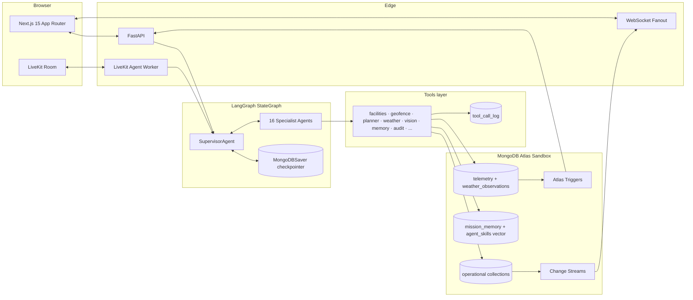
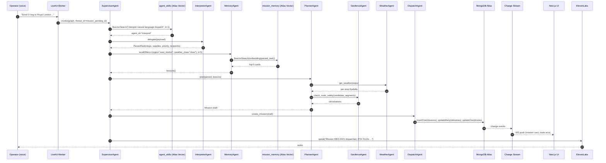
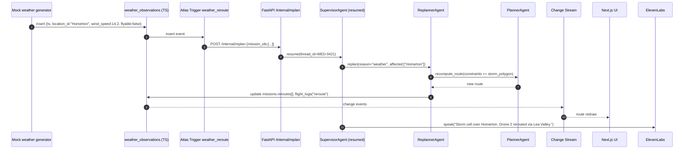
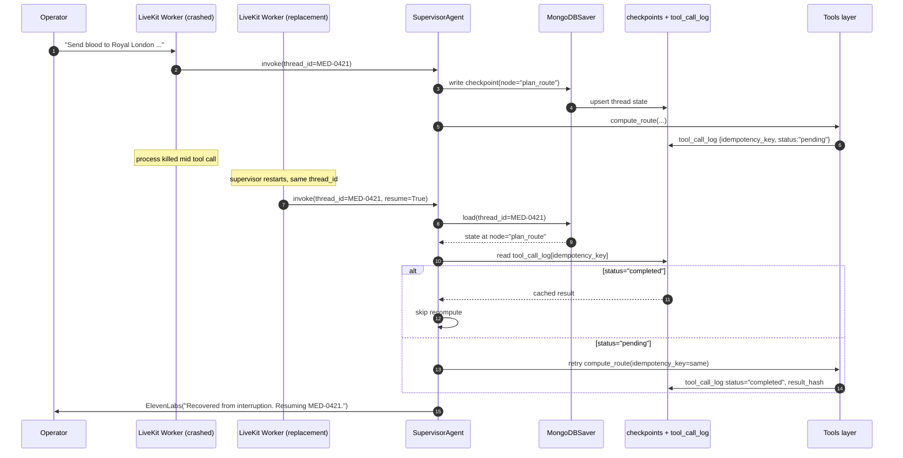
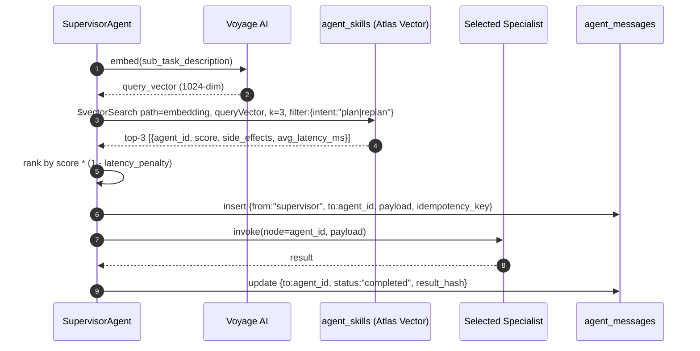

# 01 · Architecture

> Companion to `00-overview.md`. Read that first.
> Downstream contracts: `02-mongodb-data-model.md` (schemas), `03-agents-langgraph.md` (graph wiring), `08-realtime-change-streams.md` (event flow).

This file specifies the **system topology**, the **agent topology**, the **end-to-end sequence diagrams**, the **event flow through Change Streams**, the **cross-cutting concerns** (logging, security, idempotency), the **deployment topology**, and the **two concrete answers** that judges will press us on:

1. *How do agents convey their skills, identify suitable peers, share context within token limits, and execute intricate collaborative tasks?* — § 7
2. *How do you execute tool calls, retain reasoning state, recover from single failures, and ensure task consistency in multi-step tasks using MongoDB and LangChain?* — § 8

---

## 1 · System Diagram

```
┌────────────────────────────────────────────────────────────────────────────────┐
│                              OPERATOR (browser + headset)                       │
│                                                                                 │
│   Next.js 15 App Router  ─────────────  LiveKit Room (browser SDK)              │
│   (light mode UI)             │                  │                              │
│        │                      │                  │ audio in/out                 │
│        │ HTTPS REST           │ WSS              │                              │
│        │ + WebSockets         │ tracks           ▼                              │
└────────┼──────────────────────┼─────────  LiveKit Cloud / SFU                   │
         │                      │                  │                              │
         ▼                      ▼                  ▼                              │
┌──────────────────┐    ┌──────────────────┐    ┌──────────────────────────────┐  │
│  FastAPI (api)   │    │  WS Fanout (ws)  │    │  LiveKit Agent Worker (py)   │  │
│  /chat /missions │    │  /ws/mission/:id │    │  Deepgram Nova-3 STT         │  │
│  /deliveries     │    │  /ws/traces/:id  │    │  ElevenLabs Turbo v2.5 TTS   │  │
│  /memory /reports│    │  /ws/telemetry   │    │  Silero VAD                  │  │
└────────┬─────────┘    └─────────┬────────┘    └────────────┬─────────────────┘  │
         │                        │                          │                    │
         │ invokes graph          │ tails change streams     │ invokes graph      │
         ▼                        ▲                          ▼                    │
┌────────────────────────────────────────────────────────────────────────────────┐
│                       LangGraph StateGraph (graph.py)                          │
│                                                                                 │
│            ┌─────────────────  SupervisorAgent  ─────────────────┐              │
│            │                                                     │              │
│            │ peer-discovery via $vectorSearch on agent_skills    │              │
│            ▼                                                     ▼              │
│  Interpreter · Memory · Planner · Weather · Geofence · Preflight · Payload     │
│  · Dispatch · Vision · Replanner · Anomaly · Deconfliction · Narrator          │
│  · Analyst · Reflection · DemandForecast · (17 specialists)                    │
│                                                                                 │
│  thread state ──── MongoDBSaver (langgraph-checkpoint-mongodb) ──── persisted  │
└─────────────────────────────────────────┬──────────────────────────────────────┘
                                          │ tool calls (idempotent)
                                          ▼
┌────────────────────────────────────────────────────────────────────────────────┐
│  Tools layer (src/dronefleet/tools/*)  — every call writes tool_call_log       │
│  facilities · geofence · route_planner (OR-Tools) · weather · payload          │
│  · preflight · memory (MongoDBAtlasVectorSearch + Voyage AI) · drone_control   │
│  · vision (YOLO + GridFS) · audit · analytics                                  │
└─────────────────────────────────────────┬──────────────────────────────────────┘
                                          │ Motor async driver
                                          ▼
┌────────────────────────────────────────────────────────────────────────────────┐
│                       MongoDB Atlas Sandbox (system of record)                  │
│                                                                                 │
│   facilities · no_fly_zones · weather_observations [TS]                         │
│   drones · deliveries · missions · telemetry [TS] · flight_logs · audit_trail   │
│   mission_memory (vector) · regulations · chat_sessions · chat_messages         │
│   users · api_keys · synthetic_emergencies                                      │
│   agent_skills (vector) · agent_messages · tool_call_log · traces               │
│   embedding_cache · experiments · checkpoints (managed by MongoDBSaver)         │
│                                                                                 │
│   Indexes: 2dsphere · time-series · Atlas Search · Atlas Vector Search          │
│   Triggers: weather_reroute · low_battery_return · cold_chain_breach            │
│   Change Streams: missions, deliveries, flight_logs, telemetry, traces, weather │
└────────────────────────────────────────────────────────────────────────────────┘
```

The same picture as a [Mermaid graph](https://mermaid.live):



---

## 2 · Agent Topology Table

All 17 agents. Each row binds **role**, **LangGraph node name**, **tools**, **collections read**, **collections written**.

| # | Agent | LangGraph node | Primary tools | Reads | Writes |
|---|---|---|---|---|---|
| 1 | **SupervisorAgent** | `supervisor` | `delegate(agent,payload)`, `final_answer()`, `vector_pick_peer()` | `agent_skills` (vector), `agent_messages` | `agent_messages`, `traces`, `checkpoints` (via Saver) |
| 2 | **InterpreterAgent** | `interpret` | `search_facilities` (Atlas Search), `recall_operator_pref` (vector) | `facilities`, `mission_memory` (kind=`operator_pref`), `chat_messages` | `traces` |
| 3 | **MemoryAgent** | `recall_memory` | `vector_search(query, filters, k)`, `summarise_for_planner` | `mission_memory` | `traces`, `agent_messages` |
| 4 | **PlannerAgent** | `plan_route` | `compute_route` (OR-Tools), `recompute_route`, `geo_query_nofly` | `facilities`, `no_fly_zones`, `drones`, `mission_memory` (filtered) | `missions`, `traces` |
| 5 | **WeatherAgent** | `weather_check` | `get_weather`, `simulate_weather_event` | `weather_observations` | `weather_observations` (synthetic), `traces` |
| 6 | **GeofenceAgent** | `geofence_check` | `check_route_safety` (`$geoIntersects`) | `no_fly_zones` | `traces`, `flight_logs` |
| 7 | **PayloadAgent** | `payload_status` | `cold_chain_predict`, `assemble_manifest` | `deliveries`, `telemetry` | `traces` |
| 8 | **PreflightAgent** | `preflight` | `run_preflight` | `drones`, `deliveries`, `weather_observations` | `flight_logs`, `traces` |
| 9 | **DispatchAgent** | `dispatch` | `create_mission`, `assign_drone`, `open_change_stream` | `drones`, `deliveries` | `missions`, `deliveries`, `drones`, `flight_logs` |
| 10 | **VisionAgent** | `vision_scan` | `detect_obstacles`, `save_frame` (GridFS) | `telemetry` | `flight_logs` (`event:"obstacle"`), GridFS bucket `frames` |
| 11 | **ReplannerAgent** | `replan` | `recompute_route`, `update_mission` | `missions`, `weather_observations`, `no_fly_zones`, `mission_memory` | `missions.reroutes[]`, `flight_logs`, `traces` |
| 12 | **AnomalyAgent** | `anomaly_detect` | `detect_anomaly` | `telemetry`, `missions` | `flight_logs` (`event:"anomaly"`), `traces` |
| 13 | **DeconflictionAgent** | `deconflict` | `check_separation` (`$near`) | `drones`, `missions` | `flight_logs`, `traces` |
| 14 | **NarratorAgent** | `narrate` | `speak(text, voice_id)` | tail of `flight_logs`, `missions`, `traces` | LiveKit audio track, `traces` |
| 15 | **AnalystAgent** | `analyse` | `aggregate_metrics`, `generate_report` (PDF→GridFS), `compare_alternatives` | `missions`, `telemetry`, `flight_logs`, `audit_trail` | `experiments`, GridFS bucket `reports` |
| 16 | **ReflectionAgent** | `reflect` | `embed_and_store(card)` | `missions`, `telemetry`, `flight_logs`, `experiments` | `mission_memory` (≥6 cards), `traces` |
| 17 | **DemandForecastAgent** | `forecast_demand` | `forecast_demand`, `preposition_drones` | `synthetic_emergencies`, `facilities`, `drones` | `drones.current_location`, `traces` |

> Naming rule: LangGraph node ids are **snake_case verbs**. Agent class names are **PascalCase nouns ending in `Agent`**. Skill cards in `agent_skills` use `agent_id = supervisor | interpret | recall_memory | …` — i.e., the node name.

---

## 3 · Sequence Diagrams

All five flows are **async**; every arrow without an explicit `await` is fire-and-forget. Times are illustrative.

### 3.1 Cold dispatch (operator → wheels-up)



Latency budget: under 2.5 s end-to-end on warm cluster.

### 3.2 Mid-flight reroute via Atlas Trigger



### 3.3 Post-flight reflection loop

```mermaid
sequenceDiagram
  autonumber
  participant DSP as DispatchAgent (mission complete)
  participant ANA as AnalystAgent
  participant DB as MongoDB Atlas
  participant REF as ReflectionAgent
  participant V as Voyage AI (voyage-3-large)
  participant MM as mission_memory
  participant EXP as experiments

  DSP->>DB: update missions.status="completed"
  DB->>ANA: change-stream "mission completed"
  ANA->>DB: aggregate metrics over telemetry/flight_logs/audit_trail
  ANA->>EXP: insert run summary (take, time, distance, reroutes)
  ANA->>REF: hand off mission summary
  REF->>V: embed each candidate card
  V-->>REF: vectors (1024-dim)
  REF->>MM: insertMany([{kind:"reflection",...},{kind:"incident",...},{kind:"route_lesson",...}, ...])
  REF->>DB: traces "reflection complete; cards=N"
```

Contract: `N >= 6` per completed mission (SM-2). Asserted in `tests/test_self_evolution.py`.

### 3.4 Recovery after crash via MongoDB checkpointer



### 3.5 Agent peer discovery via Skill Registry



---

## 4 · Event Flow Through Change Streams

This is the live nervous system of the platform. Every subscriber is a **Motor `AsyncIOMotorChangeStream`** opened with `full_document="updateLookup"` and resume tokens persisted in `change_stream_resume`.

| Watched collection | Pipeline filter | Subscriber | Emitted event | UI surface |
|---|---|---|---|---|
| `missions` | `{$match:{operationType:{$in:["insert","update","replace"]}}}` | `ws.py: stream_missions()` | `mission.upserted` | Dashboard mission list, map markers |
| `deliveries` | same | `ws.py: stream_deliveries()` | `delivery.upserted` | Deploy queue, status pills |
| `flight_logs` | `{$match:{operationType:"insert"}}` | `ws.py: stream_flight_logs()`, **NarratorAgent** subscriber | `flight.event` | Reasoning Stream, voice narration |
| `telemetry` | `{$match:{operationType:"insert", "fullDocument.drone_id":{$in:[...]}}}` | `ws.py: stream_telemetry(drone_id)` | `telemetry.tick` | Live drone trail, battery gauge, payload temp |
| `weather_observations` | `{$match:{operationType:"insert"}}` | **Atlas Trigger** `weather_reroute`, `ws.py: stream_weather()` | `weather.update`, `replan.triggered` | Weather panel + auto-reroute side effect |
| `mission_memory` | `{$match:{operationType:"insert"}}` | `ws.py: stream_memory()` | `memory.added` | Reflection Feed (real-time scroll) |
| `traces` | `{$match:{operationType:"insert", "fullDocument.mission_id":X}}` | `ws.py: stream_traces(mission_id)` | `trace.append` | Reasoning Stream (per mission) |
| `agent_messages` | same | `ws.py: stream_agent_chatter()` | `agent.message` | Debug panel (toggleable) |
| `tool_call_log` | `{$match:{operationType:"insert"}}` | metrics aggregator | `tool.invoked` | Latency histograms |

Idempotency for fanout: every WS message carries a `(collection, _id, operationType, clusterTime)` envelope so the client can de-dupe across reconnects.

---

## 5 · Cross-Cutting Concerns

### 5.1 Logging

- All structured events land in **`traces`** collection. Document shape:
  ```ts
  { _id, mission_id?, thread_id, otel_trace_id, otel_span_id, parent_span_id?,
    agent_id, node, event, payload, ts, level, latency_ms? }
  ```
- OpenTelemetry: every `@tool` is wrapped with `tracer.start_as_current_span("tool.<name>")`. The `otel_trace_id` is propagated into LangGraph state and stamped on every checkpoint, so the Reasoning Stream can correlate.
- Index: `{mission_id:1, ts:1}`, `{otel_trace_id:1}`. TTL 30 days.

### 5.2 Security

- **Atlas Queryable Encryption** is enabled on `audit_trail.recipient` (name, role, signature_hash) and `users.email`. Equality queries still work; range queries are not required.
- Schema:
  ```js
  encryptedFields: { fields: [
    { path: "recipient.name", bsonType: "string", queries: { queryType: "equality" } },
    { path: "recipient.role", bsonType: "string", queries: { queryType: "equality" } },
    { path: "signature_hash", bsonType: "string", queries: { queryType: "equality" } }
  ]}
  ```
- Atlas role separation: `dronan_app` (RW on operational collections), `dronan_reflect` (RW on `mission_memory` and `experiments` only), `dronan_readonly` (UI debug).
- Secrets sourced from environment (`.env.example` in `13-implementation-plan.md`); never logged.
- Rate limit FastAPI per operator via Redis-less token bucket stored in `rate_limits` collection (TTL bucketed).

### 5.3 Idempotency

- **Every** tool call carries an `idempotency_key = sha256(mission_id + ":" + node + ":" + seq)`. `seq` is the LangGraph step counter from the checkpoint.
- `tool_call_log` schema:
  ```ts
  { _id: idempotency_key, mission_id, node, tool, status: "pending|completed|failed",
    args_hash, result_hash, error?, started_at, completed_at }
  ```
- Unique index on `_id`. The Tools layer uses `find_one_and_update(upsert=True, return_document=AFTER)` to atomically claim a key.
- Mission state machine enforced via Mongo collection-level **`$jsonSchema`** validator + an **`$expr`** that forbids illegal transitions:
  ```js
  validator: { $expr: { $in: [ "$status", [
     "pending","planning","dispatched","in_flight","completed","failed","aborted"
  ]]}}
  ```
- Multi-step writes use the **saga pattern**: each step has a compensating action registered in `saga_log`. Example: `assign_drone` compensation is `release_drone`. On replanner failure, sagas unwind in reverse insertion order.

---

## 6 · Deployment Topology

We ship two profiles: **Local (docker-compose)** and **Cloud (Atlas + Render/Fly.io)**.

### 6.1 Local docker-compose

```yaml
# docker-compose.yml (excerpt; full version in 13-implementation-plan.md)
services:
  mongodb:
    image: mongo:7
    command: ["--replSet","rs0","--bind_ip_all","--port","27017"]
    healthcheck:
      test: ["CMD","mongosh","--eval","try{rs.status().ok}catch(e){rs.initiate()}"]
      interval: 5s
  api:
    build: ./api
    env_file: .env
    depends_on: [mongodb]
    ports: ["8000:8000"]
  livekit-worker:
    build: ./livekit
    env_file: .env
    depends_on: [api]
  web:
    build: ./web
    env_file: .env
    ports: ["3000:3000"]
```

> Replica set is **mandatory** for Change Streams. The healthcheck self-initiates `rs0` on first boot.

### 6.2 Cloud

| Component | Host | Notes |
|---|---|---|
| MongoDB | **Atlas Sandbox (M0)** during dev; **M10** for the demo cluster | Vector Search + Triggers enabled |
| FastAPI | **Render** Web Service (uvicorn workers=2) | Pinned region near Atlas region |
| LiveKit Agent Worker | **Fly.io** (region near LiveKit Cloud SFU) | Always-on; restart-on-crash to demo recovery |
| Next.js 15 | **Vercel** | App Router, ISR off, edge runtime off (we need Node for `next-auth`) |
| LiveKit | **LiveKit Cloud** | Tokens minted by `/api/livekit-token` |

---

## 7 · Concrete Answer #1: Skills, Peers, Context, Collaboration

> *"How do agents convey their skills, identify suitable peers for a sub-task, share context within token limits, perform intricate tasks resulting from collaboration?"*

### 7.1 Skill registration (how agents convey their skills)

On worker boot, every agent class invokes `register_skill()`. Example for `PlannerAgent`:

```python
# src/dronefleet/agents/planner.py
SKILL = SkillCard(
    agent_id="plan_route",
    title="Route Planner (OR-Tools VRP)",
    description=(
        "Solves multi-stop vehicle routing with priority, no-fly polygons, "
        "weather penalties, payload weight, and battery constraints. "
        "Accepts a parsed delivery task plus retrieved lessons. "
        "Returns an ordered route per drone with predicted distance, time, battery."
    ),
    intents=["plan", "replan", "feasibility_check"],
    side_effects="writes:missions",
    avg_latency_ms=420,
    success_ratio=0.97,
    tools=["compute_route", "recompute_route", "geo_query_nofly"],
)

async def register_skill(db):
    vec = await voyage_embed(SKILL.description)
    await db.agent_skills.update_one(
        {"_id": SKILL.agent_id},
        {"$set": {**SKILL.model_dump(), "embedding": vec, "updated_at": utcnow()}},
        upsert=True,
    )
```

`agent_skills` is indexed with an Atlas Vector Search index `agent_skills_vec`:

```json
{"fields":[
  {"type":"vector","path":"embedding","numDimensions":1024,"similarity":"cosine"},
  {"type":"filter","path":"intents"},
  {"type":"filter","path":"side_effects"}
]}
```

### 7.2 Peer discovery (how supervisor picks the right agent)

```python
# src/dronefleet/agents/supervisor.py
async def pick_peer(sub_task: str, intent: str, k: int = 3):
    qv = await voyage_embed(sub_task)
    pipeline = [
        {"$vectorSearch": {
            "index": "agent_skills_vec",
            "path": "embedding",
            "queryVector": qv,
            "numCandidates": 50,
            "limit": k,
            "filter": {"intents": intent},
        }},
        {"$project": {"agent_id":1, "avg_latency_ms":1, "success_ratio":1,
                      "score": {"$meta": "vectorSearchScore"}}},
    ]
    cands = [c async for c in db.agent_skills.aggregate(pipeline)]
    cands.sort(key=lambda c: c["score"] * c["success_ratio"]
                              / (1 + c["avg_latency_ms"]/1000), reverse=True)
    return cands[0]["agent_id"]
```

### 7.3 Context sharing within token limits

Two layers, both MongoDB-backed:

1. **Per-thread short context** — `MongoDBChatMessageHistory` (last N=20 turns) plus the `MissionPlanState` TypedDict from the LangGraph thread. Both are slim by construction (no raw tool outputs; only summaries).
2. **Long-context compression** — when the planner needs to ingest lessons, regulations, and operator preferences, we wrap the retriever with **`ContextualCompressionRetriever`** + `LLMChainExtractor` so only the spans relevant to the current sub-task survive. Token budget is enforced upstream by `MongoDBConversationSummaryBufferMemory` (custom subclass that summarises earlier turns to a single rolling summary stored at `chat_sessions.summary`).

```python
from langchain_mongodb import MongoDBAtlasVectorSearch
from langchain.retrievers import ContextualCompressionRetriever
from langchain.retrievers.document_compressors import LLMChainExtractor

vs = MongoDBAtlasVectorSearch(collection=db.mission_memory,
                              embedding=voyage_embeddings,
                              index_name="mission_memory_vec",
                              text_key="text", embedding_key="embedding")
retriever = vs.as_retriever(search_kwargs={
    "k": 5,
    "pre_filter": {"metadata.region": region, "metadata.weather_class": wx_class},
})
compressed = ContextualCompressionRetriever(
    base_compressor=LLMChainExtractor.from_llm(llm),
    base_retriever=retriever,
)
docs = await compressed.aget_relevant_documents(sub_task)  # bounded ≤ ~800 tokens
```

### 7.4 Intricate collaborative tasks

A2A messages are written to `agent_messages` for **audit + replay**. Schema:

```ts
{ _id, mission_id, thread_id, from, to, intent, payload, idempotency_key,
  status: "pending|completed|failed", result_hash?, ts, latency_ms? }
```

Indexes: `{mission_id:1, ts:1}`, `{idempotency_key:1, unique:true}`.

The replay endpoint (`/internal/replay/{mission_id}`) re-invokes the graph against a fresh `thread_id_replay` and streams every agent message, allowing judges to step through any past mission.

---

## 8 · Concrete Answer #2: Tool Calls, Reasoning State, Recovery, Consistency

> *"How do you execute tool calls, retain reasoning state, recover from single failures, and ensure task consistency in multi-step tasks using MongoDB and LangChain?"*

### 8.1 Tool calls

Every tool is a LangChain `@tool` async function. The wrapper handles idempotency, OTEL spans, and `tool_call_log`:

```python
def mongo_tool(fn):
    @wraps(fn)
    async def wrapper(*args, **kwargs):
        key = make_idempotency_key(kwargs)
        existing = await db.tool_call_log.find_one({"_id": key, "status": "completed"})
        if existing:
            return existing["result"]
        await db.tool_call_log.update_one(
            {"_id": key},
            {"$setOnInsert": {"status":"pending","started_at":utcnow(),
                              "tool":fn.__name__,"args_hash":sha256(args,kwargs)}},
            upsert=True,
        )
        try:
            result = await fn(*args, **kwargs)
            await db.tool_call_log.update_one({"_id": key}, {"$set": {
                "status":"completed","completed_at":utcnow(),
                "result":result,"result_hash":sha256(result)}})
            return result
        except Exception as e:
            await db.tool_call_log.update_one({"_id": key}, {"$set": {
                "status":"failed","error":str(e),"completed_at":utcnow()}})
            raise
    return tool(wrapper)
```

### 8.2 Reasoning-state retention

```python
from langgraph.checkpoint.mongodb import MongoDBSaver

saver = MongoDBSaver(client=client, db_name="dronan", collection_name="checkpoints")
graph = build_graph().compile(checkpointer=saver)

# Per-mission invocation
config = {"configurable": {"thread_id": mission_id}}
async for event in graph.astream(initial_state, config=config):
    ...  # state is checkpointed automatically per node
```

Checkpoints store: `MissionPlanState` (TypedDict), pending tool calls, last-written `traces` cursor. TTL: 7 days (re-runnable demos only need short retention; permanent record lives in `missions` + `mission_memory`).

### 8.3 Recovery from a single failure

1. **Worker crash**: on restart, the supervisor re-invokes `graph.ainvoke(None, config={"thread_id": mission_id})`. `MongoDBSaver` rehydrates the most recent checkpoint. Tool calls already marked `completed` in `tool_call_log` are skipped via the wrapper. (See sequence diagram §3.4.)
2. **Tool exception**: caught by wrapper, marked `failed`, supervisor consults `recovery_policy[tool]`:
   - `retry_idempotent`: re-run the same key (network blip).
   - `compensate`: invoke compensating saga step (see §5.3).
   - `escalate`: emit `traces.event="needs_human"`, NarratorAgent reads alert, Supervisor pauses thread.
3. **Atlas write rejection (`$jsonSchema` violation)**: surfaces as `WriteError`, supervisor re-routes to `ReflectionAgent` to record the malformed attempt before failing the mission.

### 8.4 Consistency in multi-step tasks

- **Mission state machine** enforced server-side via `validator: {$expr: ...}` (see §5.3). Illegal transitions are impossible.
- **Saga log** (`saga_log` collection): every completed step writes `{mission_id, step, compensation_tool, args}`. On failure, supervisor calls `compensate(mission_id)` which iterates `saga_log` in reverse.
- **Optimistic concurrency**: documents that may race (`drones`, `missions`) carry a `version` field; updates are `find_one_and_update({_id, version: v}, {$inc: {version: 1}, ...})`. Conflicts trigger replan.
- **Read-your-writes** consistency for the operator UI is provided by Change Streams (the WS push always lags the write by < 500 ms; UI does not need to poll).

---

## 9 · How to Falsify This Architecture

If any of the following are true at demo time, this design has failed:

- A required collection write is not visible to the UI within 500 ms (Change Stream broken).
- Killing the LiveKit worker mid-mission requires manual replay (checkpointer broken).
- The supervisor uses a hard-coded `if intent == "plan": planner` branch (skill registry not real).
- Take-3 of the canonical scenario does **not** beat Take-1 (self-evolution not real).
- Any data the operator hears spoken is not derivable from a Mongo document (we are bluffing).

Each of these is covered by an acceptance test in `12-acceptance-tests.md`.
