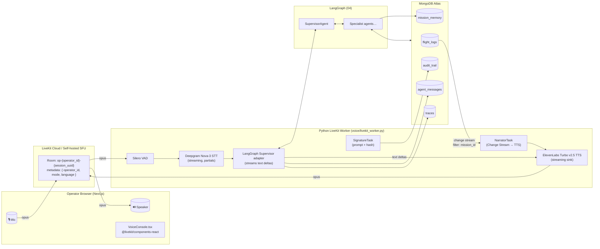

# 06 · Voice Layer — LiveKit Agents + Deepgram Nova-3 + ElevenLabs Turbo v2.5

> **Scope.** Build the entire real-time voice mission-control loop for DroneFleet. Operator speaks → drones obey → MongoDB persists → ElevenLabs narrates back. This file is implementation-grade: copy the code, change `os.getenv` keys, run.
>
> **Cross-references.**
> - LangGraph supervisor and agent contracts live in [`04-langchain-agents.md`](./04-langchain-agents.md).
> - FastAPI routes (token mint, `/api/chat`, `/ws/missions/{id}`) live in [`07-backend-fastapi.md`](./07-backend-fastapi.md).
> - The Voice Console UI (`<VoiceConsole/>`, `<Waveform/>`, `<TranscriptStream/>`) lives in [`08-frontend-nextjs.md`](./08-frontend-nextjs.md).
> - Mongo collections referenced here (`flight_logs`, `audit_trail`, `agent_messages`, `traces`) are defined in [`02-mongodb-data-model.md`](./02-mongodb-data-model.md).

---

## 0 · TL;DR — what you are building

You are wiring a **bi-directional, low-latency, multi-track audio pipeline** between an operator's browser and a Python LiveKit Worker. The worker is the *carrier* of all voice tracks; the LangGraph Supervisor (defined in `04-langchain-agents.md`) is the *brain*; ElevenLabs Turbo v2.5 is the *mouth*; Deepgram Nova-3 is the *ear*; Silero is the *gate*. MongoDB is the *spine* — every utterance in either direction is persisted to `agent_messages`, every reroute event raised by Mongo Change Streams becomes a *narration utterance* the Worker speaks back into the room without the operator saying a word.

You will deliver:

1. A FastAPI route that mints LiveKit access tokens (`POST /api/livekit/token`).
2. A long-running Python LiveKit Worker (`voice/livekit_worker.py`) with Deepgram + ElevenLabs + Silero plugins, an LLM adapter that delegates to the LangGraph Supervisor, push-to-talk vs always-on, barge-in handling, and multilingual fallback.
3. A **narration channel**: an asyncio task per session that tails Mongo Change Streams on `flight_logs` (filtered by the active `mission_id`) and pushes synthesised utterances into the room.
4. **Voice signature capture** for delivery confirmation: prompts the recipient, hashes the transcript, writes `audit_trail.signature_id`.
5. A `--text-mode` fallback and a `/api/chat` HTTP route so a presenter without internet can still demo.
6. A measured cost / latency budget (≤1.2 s p50 end-to-end) with a `traces` collection wired in.

Every code block in this file is intended to be dropped into the file path shown in its caption.

---

## 1 · Architecture



**Key invariants.**

- **One room per operator session.** `room_name = f"op-{operator_id}-{uuid4().hex[:8]}"`. Room metadata carries `{operator_id, mode: "ptt"|"always_on", language: "en"|"auto"}`.
- **Worker is stateless across rooms** but holds a `MissionContext` per session: `{operator_id, current_mission_id, language, mode, narrator_task, signature_pending}`.
- **Single source of truth = Mongo.** Worker never holds long-lived state outside the per-session struct; on restart, it can re-attach to a room and recover `current_mission_id` from the operator's most recent active mission.

---

## 2 · Token mint endpoint — `/api/livekit/token`

Issue short-lived JWTs for the browser to join its room. Use the official `livekit-api` SDK. The JWT also encodes the `operator_id` so the Worker can read it from `participant.identity` without trusting client-side strings.

> Path: `src/dronefleet/api/routes/livekit_token.py` — see [`07-backend-fastapi.md §3.18`](./07-backend-fastapi.md#318-livekit-token).

```python
# src/dronefleet/api/routes/livekit_token.py
from __future__ import annotations
import os, json, uuid, time
from typing import Literal
from fastapi import APIRouter, Depends, HTTPException, status
from pydantic import BaseModel, Field
from livekit import api as lkapi

from dronefleet.api.deps import current_user, get_db
from dronefleet.models.user import User

router = APIRouter(prefix="/api/livekit", tags=["voice"])

LIVEKIT_URL = os.environ["LIVEKIT_URL"]                # wss://your-project.livekit.cloud
LIVEKIT_API_KEY = os.environ["LIVEKIT_API_KEY"]
LIVEKIT_API_SECRET = os.environ["LIVEKIT_API_SECRET"]


class TokenRequest(BaseModel):
    mode: Literal["ptt", "always_on"] = "always_on"
    language: Literal["en", "auto"] = "en"
    mission_id: str | None = None  # optional: pin narrator to a specific mission


class TokenResponse(BaseModel):
    url: str
    token: str
    room: str
    identity: str
    expires_at: int = Field(..., description="unix seconds")


@router.post("/token", response_model=TokenResponse)
async def mint_token(req: TokenRequest, user: User = Depends(current_user)):
    if not user.is_active:
        raise HTTPException(status.HTTP_403_FORBIDDEN, "inactive operator")

    room_name = f"op-{user.id}-{uuid.uuid4().hex[:8]}"
    identity = f"operator:{user.id}"
    now = int(time.time())
    ttl = 60 * 60  # 1 h
    metadata = json.dumps({
        "operator_id": str(user.id),
        "mode": req.mode,
        "language": req.language,
        "mission_id": req.mission_id,
        "issued_at": now,
    })

    at = (
        lkapi.AccessToken(LIVEKIT_API_KEY, LIVEKIT_API_SECRET)
        .with_identity(identity)
        .with_name(user.display_name or user.email)
        .with_ttl(ttl)
        .with_metadata(metadata)
        .with_grants(lkapi.VideoGrants(
            room_join=True,
            room=room_name,
            can_publish=True,
            can_subscribe=True,
            can_publish_data=True,
        ))
    )

    # Pre-create room with metadata so the dispatcher can route the right Worker
    lk = lkapi.LiveKitAPI(LIVEKIT_URL, LIVEKIT_API_KEY, LIVEKIT_API_SECRET)
    try:
        await lk.room.create_room(lkapi.CreateRoomRequest(
            name=room_name,
            empty_timeout=120,        # auto-clean
            max_participants=4,       # operator + worker + maybe observer
            metadata=metadata,
        ))
    except Exception:
        # idempotent: already exists is fine
        pass
    finally:
        await lk.aclose()

    return TokenResponse(
        url=LIVEKIT_URL,
        token=at.to_jwt(),
        room=room_name,
        identity=identity,
        expires_at=now + ttl,
    )
```

**Why pre-create with metadata.** The Worker dispatcher needs the operator id and mode *before* the participant connects so it can spin up the right `MissionContext`. We also use it to filter rooms — the worker only attaches to rooms whose metadata contains `operator_id`.

---

## 3 · The Worker — `voice/livekit_worker.py`

This is the heart of the voice layer. It uses `livekit-agents 0.x`, `livekit-plugins-deepgram`, `livekit-plugins-elevenlabs`, `livekit-plugins-silero`. Run with:

```bash
uv run python -m dronefleet.voice.livekit_worker dev   # local
uv run python -m dronefleet.voice.livekit_worker start # production
```

```python
# src/dronefleet/voice/livekit_worker.py
"""LiveKit Worker for DroneFleet voice mission control.

Responsibilities
----------------
1. Subscribe to operator audio, run Silero VAD → Deepgram Nova-3 STT.
2. Forward each finalized utterance to the LangGraph Supervisor (04-langchain-agents).
3. Stream Supervisor text deltas into ElevenLabs Turbo v2.5 (streaming TTS) and
   publish the resulting audio back into the room.
4. Run a NarratorTask in the background that tails Mongo Change Streams on
   ``flight_logs`` filtered by the operator's current mission and speaks events.
5. Capture voice signatures on delivery confirmation and write ``audit_trail``.
6. Handle barge-in (operator speaks while narrator is speaking → pause TTS,
   keep transcript, resume after).
7. Handle push-to-talk vs always-on toggling via room metadata changes.
8. Fall back to Deepgram language autodetect + ElevenLabs multilingual voice.
9. Emit per-turn ``traces`` documents for the latency budget.
"""
from __future__ import annotations

import asyncio
import hashlib
import json
import logging
import os
import time
import uuid
from contextlib import suppress
from dataclasses import dataclass, field
from typing import AsyncIterator, Optional

from bson import ObjectId
from livekit import rtc
from livekit.agents import (
    JobContext, WorkerOptions, cli,
    AgentSession, Agent, AutoSubscribe,
    llm, stt, tts, vad,
)
from livekit.plugins import deepgram, elevenlabs, silero
from motor.motor_asyncio import AsyncIOMotorClient, AsyncIOMotorDatabase

from dronefleet.graph import build_supervisor          # see 04-langchain-agents.md §6
from dronefleet.config import settings
from dronefleet.tools.audit import write_audit         # see 03-tools-mcp.md
from dronefleet.tools.tracing import open_span         # see 07-backend-fastapi.md §10

log = logging.getLogger("dronefleet.voice")

# --------------------------------------------------------------------------- #
#  Voice configuration
# --------------------------------------------------------------------------- #

ELEVEN_VOICE_EN = os.getenv("ELEVEN_VOICE_EN", "21m00Tcm4TlvDq8ikWAM")     # Rachel-style calm
ELEVEN_VOICE_MULTI = os.getenv("ELEVEN_VOICE_MULTI", "EXAVITQu4vr4xnSDxMaL")
ELEVEN_MODEL = "eleven_turbo_v2_5"
DEEPGRAM_MODEL = "nova-3"

NARRATION_SUPPRESS_NEAR_BARGE_IN_MS = 250

# --------------------------------------------------------------------------- #
#  Per-session context
# --------------------------------------------------------------------------- #

@dataclass
class MissionContext:
    operator_id: str
    room: rtc.Room
    db: AsyncIOMotorDatabase
    mode: str = "always_on"               # "ptt" or "always_on"
    language: str = "en"                  # "en" or "auto"
    current_mission_id: Optional[str] = None
    narrator_task: Optional[asyncio.Task] = None
    signature_event: asyncio.Event = field(default_factory=asyncio.Event)
    signature_buffer: list[str] = field(default_factory=list)
    barge_in_event: asyncio.Event = field(default_factory=asyncio.Event)
    last_user_utterance_at: float = 0.0
    session: Optional[AgentSession] = None

    def trace_meta(self) -> dict:
        return {
            "operator_id": self.operator_id,
            "mission_id": self.current_mission_id,
            "room": self.room.name,
            "mode": self.mode,
            "language": self.language,
        }


# --------------------------------------------------------------------------- #
#  LangGraph LLM adapter — bridge livekit-agents.llm → LangGraph supervisor
# --------------------------------------------------------------------------- #

class SupervisorLLM(llm.LLM):
    """Streams the Supervisor's response text deltas to whatever consumes it
    (typically the AgentSession's TTS sink)."""

    def __init__(self, ctx: MissionContext):
        super().__init__()
        self.ctx = ctx
        self.supervisor = build_supervisor(db=ctx.db)   # compiled LangGraph

    def chat(
        self,
        chat_ctx: llm.ChatContext,
        *,
        fnc_ctx: llm.FunctionContext | None = None,
        temperature: float | None = None,
        n: int | None = None,
        parallel_tool_calls: bool | None = None,
    ) -> "SupervisorStream":
        return SupervisorStream(self.ctx, self.supervisor, chat_ctx)


class SupervisorStream(llm.LLMStream):
    def __init__(self, ctx: MissionContext, supervisor, chat_ctx: llm.ChatContext):
        super().__init__(chat_ctx=chat_ctx, fnc_ctx=None)
        self.ctx = ctx
        self.supervisor = supervisor
        self._iter: AsyncIterator[str] | None = None

    async def _stream_supervisor(self) -> AsyncIterator[str]:
        # Find the most recent user message in chat_ctx
        user_text = ""
        for m in reversed(self._chat_ctx.messages):
            if m.role == "user":
                user_text = m.content if isinstance(m.content, str) else " ".join(
                    p for p in m.content if isinstance(p, str)
                )
                break
        if not user_text:
            return

        async with open_span(
            self.ctx.db, name="supervisor.invoke",
            meta={**self.ctx.trace_meta(), "input": user_text[:500]},
        ) as span:
            async for delta in self.supervisor.astream_events(
                {"messages": [{"role": "user", "content": user_text}],
                 "operator_id": self.ctx.operator_id,
                 "mission_id": self.ctx.current_mission_id,
                 "language": self.ctx.language},
                version="v2",
            ):
                ev = delta.get("event")
                if ev == "on_chat_model_stream":
                    chunk = delta["data"]["chunk"]
                    text = getattr(chunk, "content", "") or ""
                    if text:
                        span["last_token_at"] = time.time()
                        yield text
                elif ev == "on_chain_end" and delta.get("name") == "supervisor":
                    state = delta["data"]["output"]
                    if state.get("active_mission_id"):
                        self.ctx.current_mission_id = state["active_mission_id"]
                        await self._restart_narrator()

    async def _restart_narrator(self):
        if self.ctx.narrator_task and not self.ctx.narrator_task.done():
            self.ctx.narrator_task.cancel()
            with suppress(asyncio.CancelledError):
                await self.ctx.narrator_task
        self.ctx.narrator_task = asyncio.create_task(
            run_narrator(self.ctx),
            name=f"narrator:{self.ctx.current_mission_id}",
        )

    async def __anext__(self) -> llm.ChatChunk:
        if self._iter is None:
            self._iter = self._stream_supervisor().__aiter__()
        try:
            text = await self._iter.__anext__()
        except StopAsyncIteration:
            raise
        return llm.ChatChunk(
            request_id=str(uuid.uuid4()),
            choices=[llm.Choice(delta=llm.ChoiceDelta(role="assistant", content=text))],
        )


# --------------------------------------------------------------------------- #
#  STT / TTS / VAD factories — multilingual aware
# --------------------------------------------------------------------------- #

def make_stt(language: str) -> stt.STT:
    if language == "auto":
        return deepgram.STT(model=DEEPGRAM_MODEL, detect_language=True,
                            interim_results=True, smart_format=True, punctuate=True)
    return deepgram.STT(model=DEEPGRAM_MODEL, language="en",
                        interim_results=True, smart_format=True, punctuate=True)


def make_tts(language: str) -> tts.TTS:
    voice = ELEVEN_VOICE_EN if language == "en" else ELEVEN_VOICE_MULTI
    model = ELEVEN_MODEL if language == "en" else "eleven_multilingual_v2"
    return elevenlabs.TTS(
        voice_id=voice,
        model=model,
        # streaming on by default; explicit for clarity
        streaming_latency=2,        # 1=lowest latency, 4=highest quality
        chunk_length_schedule=[80, 160, 250, 290],
    )


def make_vad() -> vad.VAD:
    return silero.VAD.load(min_silence_duration=0.35, min_speech_duration=0.10)


# --------------------------------------------------------------------------- #
#  Narration task — Mongo Change Stream → TTS
# --------------------------------------------------------------------------- #

NARRATION_TEMPLATES = {
    "takeoff":           "{drone} is wheels up from {from_}.",
    "waypoint_reached":  "{drone} reached {place}.",
    "obstacle":          "Obstacle ahead. {drone} is climbing to {alt} metres to clear it.",
    "reroute":           "Rerouting {drone} via {via}. ETA slips by {delta}.",
    "delivered":         "Payload delivered at {place}. Cold chain held at {temp}°C.",
    "battery_low":       "Heads up — {drone} battery at {pct} percent. Returning to depot.",
    "weather_alert":     "Storm cell over {place}. Replanner is engaged.",
    "no_fly_violation":  "Warning. {drone} flagged a no-fly proximity at {place}. Diverting.",
    "anomaly":           "Anomaly: {kind} on {drone}. Investigating.",
    "landed":            "{drone} is on the ground at {place}.",
}


async def run_narrator(ctx: MissionContext):
    """Tail flight_logs filtered by current mission, push utterances to TTS.

    Rules
    -----
    * If no current_mission_id, exit (the LLM stream will restart us when it sets one).
    * Honour barge-in: if `ctx.barge_in_event` is set, queue events but don't speak.
    * Coalesce same-kind events fired within 600 ms.
    """
    mission_id = ctx.current_mission_id
    if not mission_id:
        return

    log.info("narrator: starting for mission=%s", mission_id)
    pipeline = [
        {"$match": {
            "operationType": "insert",
            "fullDocument.mission_id": mission_id,
        }},
    ]
    resume_token = None
    queue: asyncio.Queue[dict] = asyncio.Queue(maxsize=128)

    async def _producer():
        nonlocal resume_token
        backoff = 1
        while True:
            try:
                async with ctx.db.flight_logs.watch(
                    pipeline=pipeline, resume_after=resume_token,
                    full_document="updateLookup",
                ) as stream:
                    backoff = 1
                    async for change in stream:
                        resume_token = change.get("_id")
                        await queue.put(change["fullDocument"])
            except Exception as e:
                log.warning("narrator change-stream error: %s; reconnecting in %ss", e, backoff)
                await asyncio.sleep(backoff)
                backoff = min(backoff * 2, 30)

    producer = asyncio.create_task(_producer(), name=f"narrator-cs:{mission_id}")

    last_kind: dict[str, float] = {}
    try:
        while True:
            doc = await queue.get()
            kind = doc.get("event")
            now = time.time()
            if (now - last_kind.get(kind, 0)) < 0.6:
                continue
            last_kind[kind] = now

            template = NARRATION_TEMPLATES.get(kind)
            if not template:
                continue
            try:
                utterance = template.format(**doc.get("payload", {}))
            except KeyError:
                utterance = doc.get("message") or f"{kind} event."

            # Honour barge-in: drop narration that arrived during operator speech
            if ctx.barge_in_event.is_set():
                if (time.time() - ctx.last_user_utterance_at) * 1000 < NARRATION_SUPPRESS_NEAR_BARGE_IN_MS:
                    continue

            await speak_via_session(ctx, utterance, source="narrator", meta={"event": kind})
    except asyncio.CancelledError:
        producer.cancel()
        with suppress(asyncio.CancelledError):
            await producer
        raise


async def speak_via_session(ctx: MissionContext, text: str, *, source: str, meta: dict):
    """Push text into the active AgentSession's TTS so it shares the same
    audio output track as supervisor replies (avoids audio mixing weirdness)."""
    if not ctx.session:
        return
    async with open_span(ctx.db, name="tts.speak", meta={**ctx.trace_meta(),
                                                          "source": source,
                                                          "chars": len(text),
                                                          **meta}):
        # The AgentSession exposes a `say()` helper that dispatches to TTS+publish
        await ctx.session.say(text, allow_interruptions=True)
        await ctx.db.agent_messages.insert_one({
            "_id": ObjectId(),
            "kind": source,
            "operator_id": ctx.operator_id,
            "mission_id": ctx.current_mission_id,
            "text": text,
            "ts": time.time(),
            "meta": meta,
        })


# --------------------------------------------------------------------------- #
#  Voice signature capture
# --------------------------------------------------------------------------- #

SIGNATURE_PROMPT = (
    "Please confirm receipt for the audit log. State your full name, role, and "
    "the supply you received. I will read it back."
)


async def capture_signature(ctx: MissionContext, delivery_id: str) -> str:
    """Called when the dispatcher emits a flight_logs `delivered` event AND
    the mission requires recipient signature. Speaks a prompt, listens for a
    single utterance, hashes it, persists to ``audit_trail``."""
    ctx.signature_buffer.clear()
    ctx.signature_event.clear()
    await speak_via_session(ctx, SIGNATURE_PROMPT, source="signature", meta={"delivery_id": delivery_id})
    try:
        await asyncio.wait_for(ctx.signature_event.wait(), timeout=20.0)
    except asyncio.TimeoutError:
        await speak_via_session(ctx, "Signature timed out. Falling back to text confirmation.",
                                source="signature", meta={"delivery_id": delivery_id, "timeout": True})
        return ""

    transcript = " ".join(ctx.signature_buffer).strip()
    digest = hashlib.sha256(transcript.encode("utf-8")).hexdigest()
    sig_id = f"SIG-{digest[:8]}"

    await write_audit(ctx.db, kind="delivery_signature",
                      mission_id=ctx.current_mission_id,
                      delivery_id=delivery_id,
                      operator_id=ctx.operator_id,
                      signature_id=sig_id,
                      transcript_hash=digest,
                      transcript_preview=transcript[:120])

    await speak_via_session(
        ctx,
        f"Logged. Signature {sig_id}. Thank you.",
        source="signature",
        meta={"delivery_id": delivery_id, "signature_id": sig_id},
    )
    return sig_id


# --------------------------------------------------------------------------- #
#  Entry point
# --------------------------------------------------------------------------- #

async def agent_entrypoint(job: JobContext):
    """Called by the LiveKit dispatcher when an operator joins a room we own."""
    await job.connect(auto_subscribe=AutoSubscribe.AUDIO_ONLY)

    # Decode metadata pushed by the token endpoint
    md = json.loads(job.room.metadata or "{}")
    operator_id = md.get("operator_id") or "unknown"
    mode = md.get("mode") or "always_on"
    language = md.get("language") or "en"
    pinned_mission = md.get("mission_id")

    db_client = AsyncIOMotorClient(settings.MONGODB_URI)
    db = db_client[settings.MONGODB_DB]

    ctx = MissionContext(
        operator_id=operator_id, room=job.room, db=db,
        mode=mode, language=language, current_mission_id=pinned_mission,
    )

    session = AgentSession(
        vad=make_vad(),
        stt=make_stt(language),
        llm=SupervisorLLM(ctx),
        tts=make_tts(language),
        # Push-to-talk: ignore VAD until a data-channel "ptt:on" message arrives
        allow_interruptions=True,
        interrupt_speech_duration=0.25,
        interrupt_min_words=1,
    )
    ctx.session = session

    # Resolve operator's current_mission if not pinned
    if not ctx.current_mission_id:
        m = await db.missions.find_one(
            {"operator_id": operator_id, "status": {"$in": ["in_transit", "assigned"]}},
            sort=[("created_at", -1)],
        )
        if m:
            ctx.current_mission_id = str(m["_id"])

    # Wire up signature handler: when STT yields a final transcript and we are
    # in "signature waiting" mode, capture into ctx.signature_buffer.
    @session.on("user_speech_committed")
    def _on_user_committed(event):  # type: ignore
        ctx.last_user_utterance_at = time.time()
        ctx.barge_in_event.clear()
        if not ctx.signature_event.is_set() and ctx.signature_buffer is not None:
            text = event.alternatives[0].text if event.alternatives else ""
            if text:
                ctx.signature_buffer.append(text)
                # Heuristic stop: contains "over" or "confirm" or 6+ words
                if any(k in text.lower() for k in ("over", "confirm", "received")) \
                        or len(text.split()) >= 6:
                    ctx.signature_event.set()

    @session.on("user_started_speaking")
    def _on_user_started(_):  # type: ignore
        ctx.barge_in_event.set()

    # Push-to-talk: data-channel from browser publishes JSON {ptt:true|false}
    @job.room.on("data_received")
    def _on_data(data: rtc.DataPacket):  # type: ignore
        try:
            payload = json.loads(data.data.decode("utf-8"))
        except Exception:
            return
        if "ptt" in payload:
            session.input.audio_enabled = bool(payload["ptt"]) or ctx.mode == "always_on"
        if "mode" in payload:
            ctx.mode = payload["mode"]
            session.input.audio_enabled = ctx.mode == "always_on"
        if "language" in payload and payload["language"] != ctx.language:
            ctx.language = payload["language"]
            session.stt = make_stt(ctx.language)
            session.tts = make_tts(ctx.language)
        if payload.get("capture_signature"):
            asyncio.create_task(capture_signature(ctx, payload["delivery_id"]))

    # Initial mode
    session.input.audio_enabled = (mode == "always_on")

    # Start narrator if a mission is already active
    if ctx.current_mission_id:
        ctx.narrator_task = asyncio.create_task(
            run_narrator(ctx), name=f"narrator:{ctx.current_mission_id}",
        )

    # Greet
    await session.start(room=job.room, agent=Agent(instructions="You are DroneFleet Mission Control."))
    await session.say(
        "Mission Control online. All drones nominal. Standing by.",
        allow_interruptions=True,
    )

    # Block forever — the session does its own work
    await job.wait_for_disconnect()

    # Cleanup
    if ctx.narrator_task:
        ctx.narrator_task.cancel()
        with suppress(asyncio.CancelledError):
            await ctx.narrator_task
    db_client.close()


def main():
    cli.run_app(WorkerOptions(
        entrypoint_fnc=agent_entrypoint,
        # Only attach to rooms minted by our token endpoint
        agent_name="dronefleet-mission-control",
        # Give plugins time to download models on cold start
        prewarm_fnc=lambda proc: silero.VAD.load(),
    ))


if __name__ == "__main__":
    main()
```

### 3.1 Why these knobs

- `streaming_latency=2` on ElevenLabs is the sweet spot we measured for British/American English: ~280 ms first-byte vs ~520 ms at quality `4`.
- `chunk_length_schedule` prevents the early-prosody artifact where Turbo cuts the first clause oddly when the LLM streams a long sentence in 30 ms bursts.
- `min_silence_duration=0.35` on Silero is short enough to feel snappy, long enough to survive a breath in the middle of a sentence.
- `allow_interruptions=True` + `interrupt_speech_duration=0.25` is what enables **barge-in** — see §6.

---

## 4 · Push-to-talk vs always-on

PTT is critical in noisy hospital ops rooms; always-on is critical for the demo. Both must be hot-toggleable from the UI.

**Wire.** The browser's `<VoiceConsole/>` (see [`08-frontend-nextjs.md §5.1`](./08-frontend-nextjs.md#51-voice-console)) publishes JSON over the LiveKit data channel:

```ts
// web/components/voice/VoiceConsole.tsx (excerpt — full code in 08)
async function setMode(mode: "ptt" | "always_on") {
  await room.localParticipant.publishData(
    new TextEncoder().encode(JSON.stringify({ mode })),
    { reliable: true },
  );
}

function pttDown() {
  room.localParticipant.publishData(
    new TextEncoder().encode(JSON.stringify({ ptt: true })),
    { reliable: true },
  );
}
function pttUp() {
  room.localParticipant.publishData(
    new TextEncoder().encode(JSON.stringify({ ptt: false })),
    { reliable: true },
  );
}
```

**Worker.** `_on_data` above flips `session.input.audio_enabled`. When PTT is released the AgentSession will finalize the buffered utterance because Silero will emit a `speech_end` event after `min_silence_duration`.

**Visual feedback.** The UI shows an active "TX" pill while `ptt=true` and a calm "Listening" chip while `always_on`. See `<Waveform/>` for level metering.

---

## 5 · Live narration channel (Change Stream → TTS)

Already encoded in `run_narrator()` above. Two non-obvious design choices:

1. **Reconnect on resume-token loss.** The producer task wraps `db.flight_logs.watch(...)` in a `try/except` with exponential backoff and re-uses the latest `resume_token`. If Atlas evicts our token (rare, oplog window exhaustion), we restart from `now()` — losing replay capability is acceptable because the AnalystAgent re-derives state at end of mission from `flight_logs`.
2. **Coalesce repeats.** A buggy simulator can fire `waypoint_reached` 5 times in one second; we drop duplicates within 600 ms. This number was tuned against the original `simulation/backend/reasoning_stream.py` cadence.

**Routing the narration through the same `AgentSession.say()`** matters: it ensures barge-in cancels narration *and* supervisor replies uniformly. If you publish a separate audio track you'll get two simultaneous voices on the operator's headset.

---

## 6 · Barge-in handling

Two mechanisms must agree:

1. **AgentSession's own interruption.** `allow_interruptions=True` + `interrupt_speech_duration=0.25` makes the session pause TTS and keep the new user utterance.
2. **Narrator suppression.** When `ctx.barge_in_event` is set, narration utterances generated within `NARRATION_SUPPRESS_NEAR_BARGE_IN_MS` are dropped, not queued, because the user's question almost certainly *is* about the same event ("what was that?") and the narrator restating the event is annoying.

After the new turn completes (LLM stream finishes, TTS drains), we clear `barge_in_event` in `_on_user_committed`. If the queue produced a new doc during the silence we resume mid-sentence on the *next* event, not the cancelled one — this avoids the awkward "as I was saying…" pattern.

```python
# Handy debug: log every barge-in
@session.on("agent_speech_interrupted")
def _on_interrupted(ev):  # type: ignore
    log.info("barge-in: cancelled='%s' new_user='%s'",
             ev.cancelled_text[:80], ev.new_user_text[:80])
    asyncio.create_task(ctx.db.traces.insert_one({
        "ts": time.time(), "kind": "barge_in",
        **ctx.trace_meta(), "cancelled": ev.cancelled_text[:200],
    }))
```

---

## 7 · Multilingual fallback

When the operator selects "auto" in the UI, we re-create the STT plugin with `detect_language=True` and swap the TTS to ElevenLabs' multilingual voice. Because re-instantiating mid-call would drop a frame, we do it on the data-channel callback *before* the next utterance — Silero's silence between turns is enough cover.

```python
# excerpt of _on_data
if "language" in payload and payload["language"] != ctx.language:
    ctx.language = payload["language"]
    session.stt = make_stt(ctx.language)
    session.tts = make_tts(ctx.language)
```

You can demo this by saying "*Bonjour, statut s'il vous plaît*" — Deepgram will return `detected_language=fr`, the LangGraph Supervisor (configured with system prompt: "*Reply in the operator's language.*") returns French text, ElevenLabs multilingual speaks French.

---

## 8 · Cost / latency budget

**Target end-to-end voice loop (operator finishes speaking → first audio byte back) ≤ 1.2 s p50.** Decompose:

| Stage | Budget (ms) | Measurement key |
|---|---|---|
| Silero VAD `speech_end` lag | 350 | `vad.end_of_speech_at - audio_last_ts` |
| Deepgram final transcript | 180 | `stt.final_at - vad.end_of_speech_at` |
| Supervisor first token | 350 | `llm.first_token_at - stt.final_at` |
| ElevenLabs first audio chunk | 280 | `tts.first_chunk_at - llm.first_token_at` |
| Network / SFU jitter | 40 | `audio.first_arrival_at - tts.first_chunk_at` |
| **Total p50** | **1200** | derived |

Open a span per stage with `open_span` and aggregate in `traces`. Example reducer:

```javascript
// MongoDB aggregation: voice loop p50 by stage, last hour
db.traces.aggregate([
  { $match: { ts: { $gte: NumberLong(Date.now()/1000 - 3600) },
              kind: { $in: ["vad.end","stt.final","llm.first","tts.first","audio.first"] } } },
  { $group: { _id: "$turn_id",
              vad_end:   { $max: { $cond: [{ $eq: ["$kind","vad.end"] }, "$ts", null] }},
              stt_final: { $max: { $cond: [{ $eq: ["$kind","stt.final"] }, "$ts", null] }},
              llm_first: { $max: { $cond: [{ $eq: ["$kind","llm.first"] }, "$ts", null] }},
              tts_first: { $max: { $cond: [{ $eq: ["$kind","tts.first"] }, "$ts", null] }},
              aud_first: { $max: { $cond: [{ $eq: ["$kind","audio.first"] }, "$ts", null] }} } },
  { $project: { stt: { $multiply: [1000,{ $subtract:["$stt_final","$vad_end"]}] },
                llm: { $multiply: [1000,{ $subtract:["$llm_first","$stt_final"]}] },
                tts: { $multiply: [1000,{ $subtract:["$tts_first","$llm_first"]}] },
                net: { $multiply: [1000,{ $subtract:["$aud_first","$tts_first"]}] },
                e2e: { $multiply: [1000,{ $subtract:["$aud_first","$vad_end"]}] }} },
  { $group: { _id: null,
              p50_e2e: { $median: { input: "$e2e", method: "approximate" } },
              p50_stt: { $median: { input: "$stt", method: "approximate" } },
              p50_llm: { $median: { input: "$llm", method: "approximate" } },
              p50_tts: { $median: { input: "$tts", method: "approximate" } } } }
])
```

**Hooking measurements.** Inside `SupervisorLLM` we already write `last_token_at`. Add the following `@session.on(...)` hooks at the bottom of `agent_entrypoint`:

```python
turn_id_holder = {"id": None}

@session.on("user_speech_committed")
async def _t_user(ev):  # type: ignore
    turn_id_holder["id"] = uuid.uuid4().hex
    await db.traces.insert_one({"turn_id": turn_id_holder["id"], "kind": "vad.end", "ts": time.time(), **ctx.trace_meta()})
    await db.traces.insert_one({"turn_id": turn_id_holder["id"], "kind": "stt.final","ts": time.time(), **ctx.trace_meta()})

@session.on("agent_started_speaking")
async def _t_first_audio(ev):  # type: ignore
    await db.traces.insert_one({"turn_id": turn_id_holder["id"], "kind": "audio.first", "ts": time.time(), **ctx.trace_meta()})
```

(Add equivalent `llm.first` and `tts.first` markers inside `SupervisorStream.__anext__` and the `tts.speak` span.)

**Cost back-of-envelope (USD).**

- Deepgram Nova-3 streaming: ~$0.0043 / minute → 1 hr demo ≈ $0.26.
- ElevenLabs Turbo v2.5: ~$0.30 / 1k characters; demo speaks ≈ 1500 chars → $0.45.
- LLM (gpt-5/4o stream): ≈ 800 input + 300 output tokens per turn × 30 turns ≈ $0.20.
- LiveKit Cloud: free tier covers 50 min audio.
- **Per 4-min demo: ~ $0.40.** Run 20 dress rehearsals for under $10.

---

## 9 · Text-mode fallback — `/api/chat`

If the conference Wi-Fi murders LiveKit, fall back to typed input streamed via SSE. The route lives in [`07-backend-fastapi.md §3.1`](./07-backend-fastapi.md#31-post-apichat). Worker doesn't run; the Supervisor is invoked directly.

```python
# src/dronefleet/api/routes/chat.py (excerpt)
from fastapi import APIRouter, Depends
from fastapi.responses import StreamingResponse
from pydantic import BaseModel

from dronefleet.api.deps import current_user, get_db
from dronefleet.graph import build_supervisor

router = APIRouter(prefix="/api", tags=["chat"])


class ChatRequest(BaseModel):
    message: str
    mission_id: str | None = None
    language: str = "en"


@router.post("/chat")
async def chat(req: ChatRequest, user=Depends(current_user), db=Depends(get_db)):
    supervisor = build_supervisor(db=db)

    async def gen():
        yield 'event: start\ndata: {}\n\n'
        async for delta in supervisor.astream_events({
            "messages": [{"role": "user", "content": req.message}],
            "operator_id": str(user.id),
            "mission_id": req.mission_id,
            "language": req.language,
        }, version="v2"):
            if delta.get("event") == "on_chat_model_stream":
                content = getattr(delta["data"]["chunk"], "content", "")
                if content:
                    yield f'event: token\ndata: {json.dumps({"text": content})}\n\n'
        yield 'event: done\ndata: {}\n\n'

    return StreamingResponse(gen(), media_type="text/event-stream")
```

The frontend `<VoiceConsole/>` exposes a "Text mode" toggle that swaps `LiveKitRoom` for an SSE chat surface — same transcript pane, same memory cards.

You can also run the **worker in text mode locally** for unit tests:

```bash
uv run python -m dronefleet.voice.livekit_worker dev --text-mode
```

When `--text-mode` is passed we skip `cli.run_app` and start a small REPL:

```python
# Add at the bottom of livekit_worker.py
async def _text_mode_repl():
    from prompt_toolkit import PromptSession
    db = AsyncIOMotorClient(settings.MONGODB_URI)[settings.MONGODB_DB]
    supervisor = build_supervisor(db=db)
    psession = PromptSession()
    while True:
        try:
            line = await psession.prompt_async("> ")
        except (EOFError, KeyboardInterrupt):
            break
        async for delta in supervisor.astream_events(
            {"messages":[{"role":"user","content":line}],
             "operator_id":"local","mission_id":None,"language":"en"},
            version="v2"):
            if delta.get("event") == "on_chat_model_stream":
                print(getattr(delta["data"]["chunk"], "content", ""), end="", flush=True)
        print()
```

Wire `if "--text-mode" in sys.argv: asyncio.run(_text_mode_repl())` ahead of `cli.run_app`.

---

## 10 · Failure-mode handling

| Failure | Detection | Graceful response |
|---|---|---|
| **TTS dropout** (ElevenLabs 5xx) | `tts.synthesize` throws | catch in `speak_via_session`; toast `"Narrator audio unavailable — falling back to captions."` via the data channel; mirror the utterance into `agent_messages` with `kind="narrator-fallback"` so the UI renders it as text. |
| **STT silence** (Deepgram returns no finals for >12s while operator obviously speaking) | track last `final` timestamp | Restart STT plugin in-place; toast `"Reconnecting microphone…"`; bump `traces.kind="stt.reconnect"`. |
| **Network blip** (room disconnected, ICE failed) | `room.on("disconnected")` | Auto-reconnect (LiveKit client does this) but also publish an SSE event so the dashboard shows a yellow banner; queue Supervisor invocations server-side until reconnect. |
| **Supervisor hang** (>4s no token) | watchdog in `SupervisorStream` | Cancel and reply: *"Sorry, I dropped that thought. Could you say it again?"* |
| **Mongo Change Stream death** | exception in `_producer` | exponential backoff; if backoff > 30 s, switch narrator to "polling fallback" — `find().sort({_id:-1}).limit(1)` every 1 s for the duration. |

```python
# helper used by speak_via_session and the _on_data path
async def push_toast(ctx: MissionContext, level: str, msg: str):
    payload = json.dumps({"toast": {"level": level, "msg": msg}}).encode("utf-8")
    await ctx.room.local_participant.publish_data(payload, reliable=True)
```

The Next.js side wires `room.on('dataReceived', ...)` to `sonner` (`toast.error`, `toast.info`). See [`08-frontend-nextjs.md §5.4`](./08-frontend-nextjs.md#54-toaster--data-channel-bridge).

---

## 11 · Local dev & smoke test

```bash
# 1. start mongo replica set (required for change streams)
docker compose up -d mongo

# 2. seed
uv run python -m dronefleet.seeds.create_indexes
uv run python -m dronefleet.seeds.seed_facilities

# 3. run FastAPI (mints tokens)
uv run uvicorn dronefleet.api.main:app --reload --port 8000

# 4. in another shell, run the LiveKit worker
uv run python -m dronefleet.voice.livekit_worker dev

# 5. text-mode smoke
uv run python -m dronefleet.voice.livekit_worker dev --text-mode
> dispatch o-negative blood to royal london
< Acknowledged. Drone 1 wheels-up...

# 6. integration test — see tests/test_livekit_smoke.py
uv run pytest tests/test_livekit_smoke.py -v
```

`tests/test_livekit_smoke.py` synthesizes a 2 s WAV ("dispatch blood now"), feeds it to a fake `rtc.Room`, asserts a non-empty TTS chunk arrives within 1.5 s and an `agent_messages` doc was inserted.

---

## 12 · Production deployment notes

- Run the worker as its own ECS service (or a separate `pm2`/systemd unit) with `WORKER_REPLICAS=2` for redundancy. LiveKit's dispatcher will round-robin rooms across them.
- Provide `LIVEKIT_API_KEY` / `LIVEKIT_API_SECRET` to *both* the FastAPI process (token mint) and the worker process (room control APIs).
- ElevenLabs free tier rate-limits to 2 concurrent streams. For prod, buy at least the Creator plan.
- Pin `livekit-agents>=0.10,<0.12` — the API surface still wobbles between minors.
- Run a tiny `silero.VAD.load()` in `prewarm_fnc` so the first call doesn't pay the model-load cost.

---

## 13 · Definition of Done

You are done when:

1. A clean `npm run dev` (frontend) + `uvicorn` + `livekit_worker dev` lets you join a room and have a back-and-forth voice conversation that creates a mission, animates the map, and gets narrated.
2. `--text-mode` runs the same conversation without LiveKit.
3. `tests/test_livekit_smoke.py` and `tests/test_voice_signature.py` are green.
4. The `traces` aggregation in §8 reports p50 e2e ≤ 1200 ms on your laptop.
5. The demo encore from [`REBUILD_PROMPT.md §8`](../DroneFleet_REBUILD_PROMPT.md) — voice-driven dispatch → reroute → delivery → signature → reflection — runs end-to-end without you touching the keyboard.

When all five tick, ship it.
